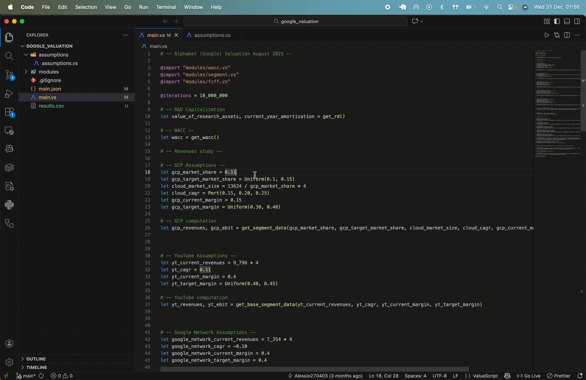
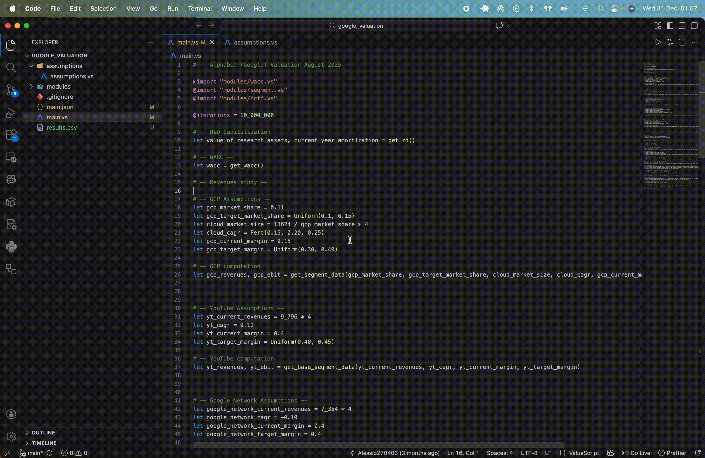

# ValuaScript: A Declarative Language for High-Performance Monte Carlo Simulations

[](https://github.com/Alessio2704/valuascript/actions)

[](https://opensource.org/licenses/MIT)

[](https://isocpp.org/std/the-standard)

[](https://www.python.org/downloads/)

---

ValuaScript combines a simple, declarative scripting language with a high-performance, multi-threaded C++ engine to create, run, and analyze complex quantitative models. It is purpose-built to deliver both **clarity and speed**, making sophisticated Monte Carlo simulations accessible and maintainable.

## The Core Philosophy: A Vocabulary for Simulations

Financial and scientific modelling often forces a choice between two extremes: the intuitive but slow, error-prone nature of spreadsheets, and the powerful but verbose, complex nature of general-purpose programming languages.

ValuaScript was created to bridge this gap. It is not a general-purpose language; it is a **vocabulary for describing simulations.**

This approach is guided by three principles:

- **Declarative & Readable:** A ValuaScript file describes **what** the model is, not **how** to compute it. There are no loops, complex data structures, or pointers. The script reads like a novel or a specification sheet, making models easy to write, review, and maintain for domain experts and programmers alike.

- **High-Performance by Design:** All the heavy lifting—numerical calculations, statistical sampling, and data aggregation—is handled by a multi-threaded C++17 engine. Scripting a model in ValuaScript is simply wiring together these pre-compiled, high-speed components. A simulation that might take minutes in other tools is executed in seconds.

- **Extensible through Contribution:** The language grows by expanding its C++ core. Need a niche financial model or a specific epidemiological simulation? Implement it once in optimized C++, and it instantly becomes a new "word" in the ValuaScript vocabulary for everyone to use. This creates a powerful, community-driven flywheel for growth.

## Architecture: AOT Compiler & Virtual Machine

ValuaScript utilizes an Ahead-of-Time (AOT) compilation pipeline to ensure runtime efficiency:

- **The `vsc` Compiler (Python):** Parses the ValuaScript script, resolves imports, performs semantic analysis, optimizes the AST, and emits **JSON bytecode**.
- **The `vse` Engine (C++17):** A fast, multi-threaded VM that loads the bytecode and executes the simulation, handling numerical computation and sampling.

## Key Features

### ✨ The ValuaScript Language

- **Intuitive Syntax:** A clean, declarative language with a familiar, spreadsheet-like formula syntax.

- **📦 Code Modularity:** Organize models into reusable modules with `@import`. The compiler resolves the entire dependency graph, including nested and shared ("diamond") dependencies.

- **🔧 User-Defined Functions:** Create reusable, type-safe functions with docstrings, strict lexical scoping, and compile-time recursion detection.

- **✨ Tuples & Multi-Assignment:** Functions can return multiple values (including mixed types like scalars and vectors), which can be unpacked into multiple variables in a single, clean assignment.

- **🛡️ Compile-Time Safety:** Catch logical errors like type mismatches, incorrect function arguments, undefined variables, and circular imports before you run.

- **🎲 Integrated Monte Carlo Support:** Natively supports a rich library of statistical distributions (`Normal`, `Pert`, `Lognormal`, `Beta`, etc.).

### 🚀 The AOT Compiler & C++ Engine

- **High-Performance Backend:** A multi-threaded Virtual Machine (VM) written in modern C++17, designed to leverage all available CPU cores for maximum parallelism.

- **🧠 Intelligent AOT Compiler:** Performs all semantic analysis and optimization _before_ execution, generating a low-level JSON bytecode for the engine.

- **⚙️ Advanced Optimizations:**

- **Function Inlining:** User-defined functions are seamlessly inlined, eliminating call overhead.

- **Loop-Invariant Code Motion:** Deterministic calculations are automatically identified and run only once.

- **Dead Code Elimination:** Unused variables are stripped from the final bytecode.

### ⚡ The VS Code Extension

- **Live Value Preview:** Hover over any variable to see its calculated value instantly. For stochastic variables, the engine runs a sample simulation in the background and displays the mean.

<p align="center">
  
</p>

- **Real-Time Diagnostics:** Get immediate, as-you-type feedback on errors.

- **Hover-for-Help:** See full signatures and docstrings for all built-in and user-defined functions.

<p align="center">
  
</p>

- **Go-to-Definition:** Seamlessly navigate to the source of any user-defined function.

## Quick Start: Installation

Get started in minutes with our automated installation scripts.

#### Prerequisites

1.  **Python 3.13+** must be installed and available in your PATH.

2.  **Administrator/sudo privileges** are required to add the tools to your system's PATH.

#### macOS & Linux

Open your terminal and run the following one-line command:

```bash
/bin/bash  -c  "$(curl  -fsSL https://raw.githubusercontent.com/Alessio2704/valuascript/main/scripts/install.sh)"
```

#### Windows

Open a new **PowerShell terminal as Administrator** and run:

```powershell
Set-ExecutionPolicy Bypass -Scope Process -Force; [System.Net.ServicePointManager]::SecurityProtocol = [System.Net.ServicePointManager]::SecurityProtocol -bor 3072; iex ((New-Object System.Net.WebClient).DownloadString('https://raw.githubusercontent.com/Alessio2704/valuascript/main/scripts/install.ps1'))
```

After installation, **you must open a new terminal window** for the changes to take effect.

#### Uninstalling

The same scripts can be used to uninstall the tools. Simply replace `install.sh` with `uninstall.sh` (for Mac/Linux) or `install.ps1` with `uninstall.ps1` (for Windows) in the commands above.

## 🚀 Performance Benchmarks

Comparison running the project found at `examples/financial/google_dcf_valuation` for 100,000 iterations (MacBook Pro M4 Pro 24gb Ram macOS Sequoia 15.6.1):

| Platform              | Iterations | Execution Time | Speedup             |
| :-------------------- | :--------- | :------------- | :------------------ |
| ValuaScript           | 100k       | 0.260s         | **1x**              |
| Excel (XLRisk Add-In) | 100k       | 45min 5s       | **~10,400x Slower** |

## 🌟 Current Status: Beta Release

ValuaScript is currently in a stable **Beta** release. Key features are implemented and tested across macOS, Windows, and Linux. The current version excels at DCF modeling and general Monte Carlo simulations.

## Roadmap

- [ ] **Empirical Distribution Sampling:** Add a function to create a custom sampler from a real-world data series (e.g., historical stock returns), allowing models to be driven by actual data instead of theoretical distributions.
- [ ] **GPU Acceleration:** Explore CUDA/OpenCL to offload the "embarrassingly parallel" Monte Carlo workload to the GPU, providing an order-of-magnitude performance increase for simulations with millions of trials.


## License

This project is distributed under the MIT License. See the `LICENSE` file for more information.
